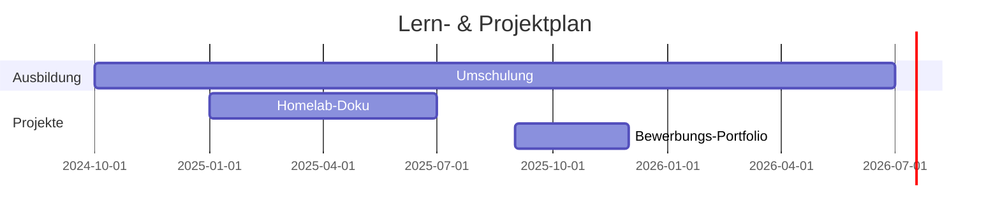

# 👋 Willkommen bei meiner IT Knowledge Base



---

## 📊 Lernfortschritt

  

    Python Grundlagen – 70%
  

  

    Docker & Container – 40%
  

  

    Ansible Automation – 20%
  

---

## 📅 Timeline (Mermaid)

