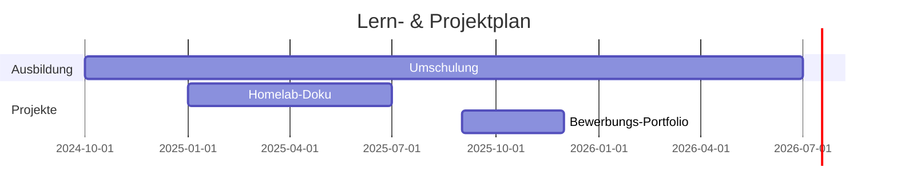

# 👋 Willkommen bei meiner IT Knowledge Base



---

## 📊 Lernfortschritt (Chart.js)

<canvas id="skillsChart" style="max-width:600px;"></canvas>

---

## 📅 Timeline (Mermaid)

```mermaid
gantt
    title Lern- & Projektplan
    dateFormat  YYYY-MM-DD
    section Ausbildung
    Umschulung :a1, 2024-10-01, 2026-07-01
    section Projekte
    Homelab-Doku   :2025-01-01, 6M
    Bewerbungs-Portfolio :2025-09-01, 3M
```
